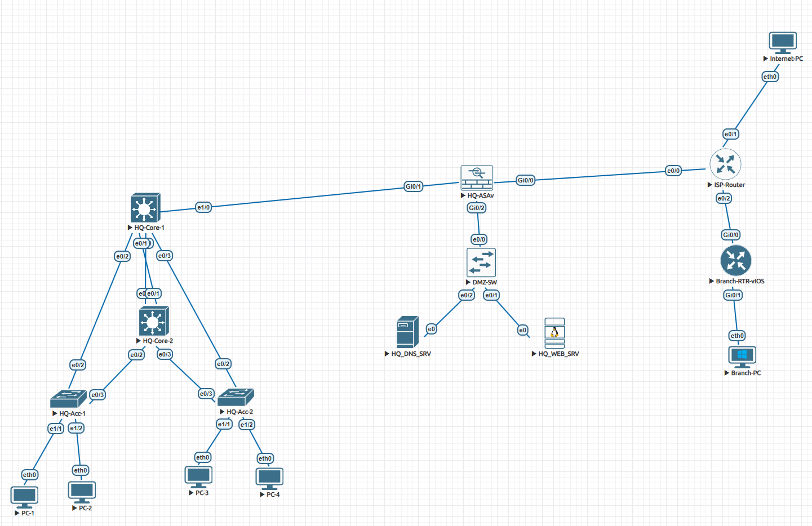

# Enterprise Network Infrastructure & Site-to-Site IKEv2 VPN Deployment

A multi-tier enterprise network I built and tested in **EVE-NG**, using **Cisco IOL** and **Cisco ASAv** images. This started as a CCNA follow-up project - I wanted to see how the theory actually holds up when you're building, breaking, and fixing a real (simulated) network end to end.



---

## Table of Contents

- [Project Overview](#project-overview)
- [Skills Demonstrated](#skills-demonstrated)
- [Architecture Breakdown](#architecture-breakdown)
- [IP Addressing Plan](#ip-addressing-plan)
- [Verification & Testing](#verification--testing)
- [Engineering Challenges & Troubleshooting Log](#engineering-challenges--troubleshooting-log)
- [Repository Structure](#repository-structure)
- [Device Configurations](#device-configurations)
- [Future Improvements](#future-improvements)
- [Lab Environment](#lab-environment)

---

## Project Overview

This is a full enterprise network for a headquarters site: redundant campus core, a segmented DMZ, a perimeter firewall, a simulated ISP in the middle, and a branch office connected back over an encrypted Site-to-Site VPN.

I built it in five phases:

| Phase | Scope |
|---|---|
| 1 | HQ LAN - Core/Access switching, VLANs, LACP, Rapid-PVST+ |
| 2 | Layer 3 & High Availability - Inter-VLAN routing, HSRPv2, DHCP |
| 3 | Perimeter & DMZ - Cisco ASAv, security zones, NAT, DNS/Web services |
| 4 | WAN & Branch Office - ISP transit, Branch-RTR (Cisco vIOS) |
| 5 | Site-to-Site VPN - IPsec/IKEv2 tunnel, NAT Exemption |

---

## Skills Demonstrated

- Hierarchical (Collapsed Core) network design - Core, Access, DMZ, and WAN tiers
- First-Hop Redundancy with **HSRPv2** (active/standby load-balanced per VLAN)
- **LACP EtherChannel** (802.3ad) link aggregation
- **VLAN segmentation** and 802.1Q trunking
- **Rapid-PVST+** with deterministic root bridge placement, PortFast & BPDU Guard
- **DHCP** and internal **DNS** services
- **Cisco ASAv** firewall: security-level zone segmentation, stateful inspection, ACLs
- **NAT**: Dynamic PAT (interface overload) and Static 1:1 NAT for DMZ publishing
- **Site-to-Site IPsec VPN (IKEv2)**: AES-256, SHA-256, DH Group 14, NAT Exemption (Twice NAT)
- Structured, methodical **troubleshooting** using standard Cisco CLI diagnostic workflows

---

## Architecture Breakdown

### 1. HQ Campus Network (Core & Access)

- **Core Layer** (`HQ-Core-1`, `HQ-Core-2`):
  - Dual Core switches interconnected via a 2-link **LACP Port-Channel** (`Po1`, trunk), carrying all VLANs including a dedicated transit VLAN toward the firewall.
  - **HSRPv2** provides gateway redundancy: `HQ-Core-1` is Active for VLAN 10 / Standby for VLAN 20; `HQ-Core-2` is Active for VLAN 20 / Standby for VLAN 10 - so both Core switches actively route traffic instead of one sitting idle.
  - Inter-VLAN routing performed at the Core via SVIs.
- **Access Layer** (`HQ-Acc-1`, `HQ-Acc-2`):
  - Each Access switch is **dual-homed** with independent 802.1Q trunk links to *both* Core switches (a design deliberately chosen over a stretched EtherChannel, since Cisco IOL does not support VSS/vPC - a single Multi-Chassis EtherChannel across two independent Core switches is not achievable in this platform).
  - **Rapid-PVST+** is tuned with explicit root bridge priorities (Core-1 = root for VLAN 10 / secondary for VLAN 20, and vice-versa for Core-2), so the redundant uplinks load-balance deterministically per VLAN instead of relying on default STP tie-breaking.
  - Host-facing ports protected with **PortFast** + **BPDU Guard**.
- **DHCP**: Core switches provide DHCP pools per VLAN for end-user devices.

### 2. Perimeter & DMZ (`HQ-ASAv`)

- **Security zones**:
  - `Inside` (Security Level 100) - transit link to the HQ Core layer
  - `DMZ` (Security Level 50) - hosts `HQ_DNS_SRV` and `HQ_WEB_SRV`
  - `Outside` (Security Level 0) - connects to the simulated ISP
- **NAT**:
  - Dynamic PAT (interface overload) for outbound HQ traffic
  - Static 1:1 NAT publishing DMZ services to a public address (e.g. `203.0.113.10` → `HQ_WEB_SRV`)
- Stateful packet inspection and interface ACLs govern what inbound traffic is permitted into the DMZ.

### 3. ISP WAN Transit (`ISP-Router`)

- Simulates a provider backbone, routing between `HQ-ASAv`, `Branch-RTR-vIOS`, and a public test host (`Internet-PC`).
- Point-to-point `/30` links and static default routing (a deliberate simplification over a full eBGP peering, appropriate for a single simulated ISP node).

### 4. Remote Branch & Site-to-Site VPN

- `Branch-RTR-vIOS` serves the branch LAN (`192.168.100.0/24`, `Branch-PC`) and defaults its WAN traffic toward the ISP.
- **Site-to-Site IPsec VPN**, migrated from IKEv1 to **IKEv2**:
  - **Phase 1 (IKEv2):** AES-CBC-256, SHA-256, DH Group 14, PSK authentication
  - **Phase 2 (IPsec):** ESP with AES-256 and SHA-256 HMAC
  - **NAT Exemption (Twice NAT)** on the ASA excludes inter-site traffic (`10.1.0.0/16` ↔ `192.168.100.0/24`) from PAT, so the tunnel carries the real private addressing end-to-end.

---

## IP Addressing Plan

| Segment | Network | Gateway / Key Address |
|---|---|---|
| VLAN 10 - Users | `10.1.10.0/24` | HSRP VIP `10.1.10.1` |
| VLAN 20 - Admin | `10.1.20.0/24` | HSRP VIP `10.1.20.1` |
| Transit VLAN 99 (Core ↔ ASA Inside) | `10.1.99.0/24` | ASA Gi0/1 `10.1.99.1` |
| DMZ | `172.16.50.0/24` | Web `.10`, DNS `.20` |
| HQ-ASA ↔ ISP (WAN) | `203.0.113.0/30` | ASA `.1`, ISP `.2` |
| Branch ↔ ISP (WAN) | `198.51.100.0/30` | Branch-RTR `.2` |
| Branch LAN | `192.168.100.0/24` | Branch-RTR `.1` |

---

## Verification & Testing

Every phase got checked with live CLI output before I called it done. A few highlights:

**Spanning-Tree load balancing (from `HQ-Acc-2`):**
```
VLAN0010  Root Port: Et0/2 (FWD)   Alternate: Et0/3 (BLK)
VLAN0020  Root Port: Et0/3 (FWD)   Alternate: Et0/2 (BLK)
```
Confirms VLAN 10 traffic flows via `HQ-Core-1` and VLAN 20 via `HQ-Core-2`, with the redundant link cleanly blocked - no traffic black-holing, no loop.

**IKEv2 Security Association (Branch-RTR):**
```
Tunnel-id  Local             Remote            Status
1          198.51.100.2/500  203.0.113.1/500   READY
Encr: AES-CBC, keysize: 256, Hash: SHA256, DH Grp:14, Auth: PSK
```

**End-to-end connectivity (Branch-PC → PC-1, across the VPN tunnel):**
```
Branch-PC> ping 10.1.10.51
84 bytes from 10.1.10.51 icmp_seq=2 ttl=62 time=20.5 ms
84 bytes from 10.1.10.51 icmp_seq=3 ttl=62 time=13.0 ms
84 bytes from 10.1.10.51 icmp_seq=4 ttl=62 time=19.3 ms
84 bytes from 10.1.10.51 icmp_seq=5 ttl=62 time=10.5 ms
```
---

## Real problems I ran into and had to actually dig into: 

**1. Multi-Chassis EtherChannel is not achievable on Cisco IOL**
The original topology implied one Access switch EtherChannel splitting across two independent Core switches. This requires VSS/vPC, which Cisco IOL does not support - attempting it causes LACP to see two different system MACs and put the link into an inconsistent/standby state. **Fix:** Redesigned to a triangle topology - independent trunk links from each Access switch to each Core switch, with Rapid-PVST+ blocking the redundant path per VLAN.

**2. IGMP Snooping silently dropped HSRP hellos**
HSRP uses multicast (224.0.0.102); with IGMP snooping active and no querier, multicast traffic between VLAN members was being suppressed, intermittently breaking HSRP adjacency. **Fix:** Adjusted IGMP snooping behavior on the affected VLANs so HSRP multicast hellos reliably reach both Core switches.

**3. Stale ARP entries from the IOL virtual MAC mechanism**
Clients' ARP tables pointed at a MAC that didn't match the active HSRP forwarder's real interface MAC, a known Cisco IOL virtualization quirk. **Fix:** Enabled `standby use-bia` on both Core switches so HSRP uses the physical interface burned-in address instead of the virtual HSRP MAC.

---

## Repository Structure

```
enterprise-network-lab/
├── README.md
├── topology.png
└── configs/
    ├── HQ-Core-1.cfg
    ├── HQ-Core-2.cfg
    ├── HQ-Acc-1.cfg
    ├── HQ-Acc-2.cfg
    ├── HQ-ASAv.cfg
    ├── DMZ-SW.cfg
    ├── ISP-Router.cfg
    ├── Branch-RTR-vIOS.cfg
    └── end-hosts.cfg          (VPCS client addressing: PC-1..4, Branch-PC, Internet-PC)
```

---

## Device Configurations

Verified running-configurations for all lab devices are available in [`/configs`](./configs):

- [HQ Core Switch 1](./configs/HQ-Core-1.cfg)
- [HQ Core Switch 2](./configs/HQ-Core-2.cfg)
- [HQ Access Switch 1](./configs/HQ-Acc-1.cfg)
- [HQ Access Switch 2](./configs/HQ-Acc-2.cfg)
- [HQ Perimeter Firewall (ASAv)](./configs/HQ-ASAv.cfg)
- [DMZ Switch](./configs/DMZ-SW.cfg)
- [ISP Transit Router](./configs/ISP-Router.cfg)
- [Branch Router (vIOS)](./configs/Branch-RTR-vIOS.cfg)
- [End-host addressing (VPCS clients)](./configs/end-hosts.cfg)

> **Heads up:** I swapped out all the actual pre-shared keys and lab passwords with <REDACTED-FOR-PUBLIC-REPO> placeholders before pushing this to a public repo.

## Future Improvements

This lab covers the core enterprise use cases end to end, but I deliberately left a few things for later instead of chasing them in this pass:

**Security & hardening**
- **Management-plane access control** - VTY lines currently only accept console access (`transport input none`); next step is SSH-only remote management with local or centralized (TACACS+/RADIUS) AAA, plus a management ACL restricting VTY access to a specific admin subnet.
- **HSRP authentication** - add MD5 authentication to the HSRP groups on both Core switches to prevent spoofed HSRP hellos from taking over the virtual gateway.
- **Native VLAN hardening** - move trunk native VLANs off VLAN 1 to a dedicated, unused VLAN to reduce VLAN-hopping exposure.
- **Unused port hardening** - explicitly shut down and assign unused Access-switch ports to a black-hole VLAN rather than leaving them at trunk/access defaults.

**Resilience**
- **HSRP uplink tracking** - configure `standby track` on both Core switches so HSRP priority drops automatically if a Core switch loses its uplink toward the ASA, instead of only reacting to a full switch failure.
- **Firewall high availability** - add a second ASAv in Active/Standby failover to remove the single point of failure at the perimeter.
- **WAN redundancy** - a second simulated ISP path (dual-homed HQ or Branch) instead of a single transit link.

**Operations**
- **Centralized logging & NTP** - a syslog server and NTP sync across all devices for consistent timestamps and a real audit trail during troubleshooting.
- **Monitoring** - SNMP/telemetry on interface status, HSRP state, and VPN tunnel health.
- **Automated config backup** - script the console-based config export used to build this repo (see `/configs`) so it runs on a schedule and commits to version control automatically, rather than a manual per-device pull.
---

## Lab Environment

| Category | Details |
|---|---|
| Platform | EVE-NG |
| Appliance Images | Cisco IOL (switches/routers), Cisco ASAv 9.x, Cisco vIOS |
| Layer 2 | 802.1Q, LACP (802.3ad), Rapid-PVST+, HSRPv2 |
| Layer 3 | IPv4, static & default routing, inter-VLAN routing |
| Firewall | Stateful inspection, security levels, ACLs |
| NAT | Dynamic PAT, Static 1:1 NAT, Twice NAT (NAT Exemption) |
| VPN | IPsec, IKEv2, ESP, AES-256, SHA-256, DH Group 14 |
